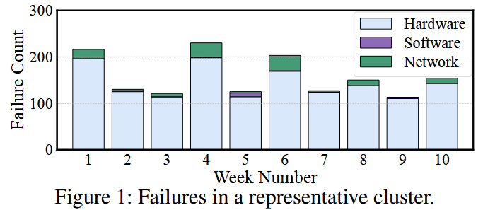

# 故障诊断
论文列表：
|序号 | 名称 | 说明 | 
| --- | --- | --- |
|1| Evolution of Aegis: Fault Diagnosis for AI Model Training Service in Production | 阿里云提出的面向AI大规模训练集群的故障诊断方法 |

## 1. Evolution of Aegis: Fault Diagnosis for AI Model Training Service in Production

由上图可知，AI训练集群中大部分故障在于硬件故障